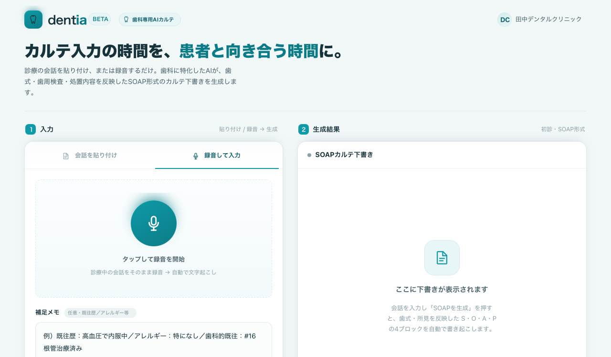
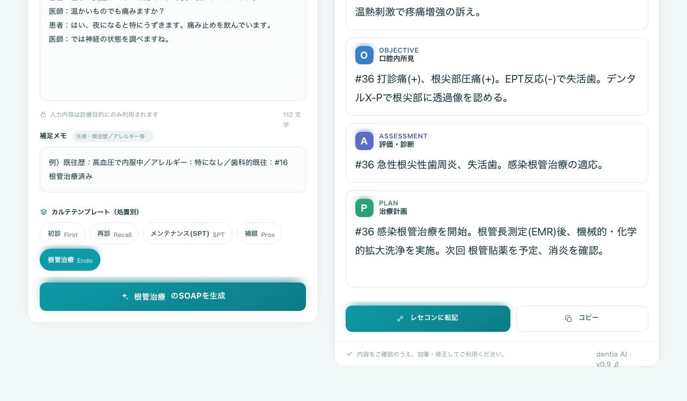

<!--
Marp形式スライド（Markdown → スライド/PDF）。
変換: https://marp.app/ に貼る / VS Code拡張 / CLI:
  npx @marp-team/marp-cli docs/sales-deck.md --pdf --allow-local-files
【注意・正直さ】
 - 数値（時短効果・料金）・会社情報は [仮] / [記入] のプレースホルダ。実値に置換すること。
 - 導入実績・顧客数・導入事例・お客様の声は未確定 → 「No Image」枠＋「※イメージ/想定/今後掲載」で明示（創作しない）。
 - 写真が入る箇所は「No Image」プレースホルダ。実UI画像は ../project/screenshots/ を使用。
 - Medimo提案資料(53P)の構成を参考に、歯科・dentia向けに翻案。
-->

<!-- _class: lead -->
<!-- _paginate: false -->

DENTAL AI CHARTING

# dentia（デンティア）
## 歯科専用 AIカルテ下書き生成

**「カルテ入力の時間を、患者と向き合う時間に。」**

診療を録音するだけで、歯科のSOAPカルテ下書きを自動生成。

---

## 目次

1. dentia とは
2. 歯科現場の相棒に（活用シーン・実績）
3. dentia の使い方
4. 他の方法との比較
5. 料金プラン
6. 導入の流れ・サポート
7. 活用シーン・運用のコツ
8. よくあるご質問・データの取り扱い
9. 会社概要・お問い合わせ

---

<!-- _class: lead -->

01
# dentia とは

### CONCEPT
**歯科医師が、目の前の患者さんに集中できる時間を取り戻す。**

---

## こんなお悩みはありませんか？

- 診療しながらの**カルテ入力が負担**で、ミスや抜け漏れが心配
- カルテを書くために**残業**になりがち
- もっと**患者さんと向き合って**診療したい
- 歯式・歯科検査・処置など**歯科特有の記載に手間**がかかる
- 記録の**書き方・質が人によってばらつく**
- スタッフ（受付・助手）の**記録の負担が大きい**

> カルテ業務の負担が、診療の質と働き方を圧迫しています。

---

## dentia 活用で期待できる3つの効果

入力時間の削減 <b>[仮] 分/日</b> 録音→数秒で下書き

残業・疲労の軽減 <b>[仮] %</b> 後回しの入力をなくす

患者と向き合う時間 <b>増加</b> 画面より会話へ

 

※ 効果は導入環境により異なります。数値は自院での実測値を記入してください（本資料は未記入）。

---

## 導入インパクト（診療の視点）

診療中の ながら入力が減る
→

患者と向き合える
→

患者満足度の向上

 

診療後の 入力時間の削減
→

残業時間の減少
→

疲労の軽減

 直接的な効果 → アウトカム

---

## 導入インパクト（経営の視点）

| 直接的な効果 | 期待できるアウトカム |
|---|---|
| 診療中・診療後の入力時間の削減 | 残業時間・**残業代の削減** |
| カルテ作成の負担軽減 | 診療に集中 → **患者対応・回転の改善** |
| 記録の構造化（SOAP）・抜け漏れ低減 | **カルテ品質の均一化**、引き継ぎが容易 |
| 人手に頼らない記録補助 | スタッフ（受付・助手）の**採用・教育負担の抑制** |

※ 一般的に見込まれる効果の整理です。効果を保証するものではありません。

---

## 記録の質も、医院の資産に

- **SOAP形式で構造化**されるので、誰が見ても分かるカルテに
- **歯式単位**で所見が整理され、**個別指導でも説明しやすい**記載粒度
- 非常勤・複数ドクター間でも**背景の引き継ぎが容易**
- スタッフ間の**記載のばらつきを軽減**

> カルテ負担の軽減だけでなく、**記録の質の標準化**にも寄与します。

---

<!-- _class: lead -->

02
# 歯科現場の相棒に

---

## 導入実績

No Image（導入実績グラフ）

※ 現在ベータ版。導入実績は今後掲載します。本ページはイメージです。

---

## 活用シーン（想定ユースケース）

- **初診**：主訴・問診＋全顎ベースライン所見を下書き
- **自費カウンセリング**：治療選択肢・リスク・費用・患者の意思決定を記録（説明と同意の記録に）
- **訪問診療**：移動中でも、録音だけで記録の下書き
- **根管治療 / SPT / 補綴**：処置別テンプレで記録を最適化

※ 上記は想定例です。実際の導入事例・お客様の声は今後掲載予定。

---

## お客様の声

<b>No Image</b>  「[ 導入医院のコメントを掲載予定 ]」 ※イメージ

<b>No Image</b>  「[ 導入医院のコメントを掲載予定 ]」 ※イメージ

 ※ ベータ導入後、実際の声を掲載します。

---

<!-- _class: lead -->

03
# dentia の使い方

---

## 使い方はシンプル（3ステップ）

1. **録音**（または会話を貼り付け）
2. テンプレを選んで **「SOAPを生成」**
3. 結果を**確認・加筆 → コピー / QRで転記**

- 録音が使えない時は**手入力**でもOK
- PC・タブレット・スマホのブラウザ対応

---

## 仕組み（2段のAIが連携）

診療を録音
→

AI① 文字起こし （音声→テキスト）
→

AI② SOAP生成 （テキスト→歯科SOAP）
→

S/O/A/P の 下書き

 

録音停止 → 自動で文字起こし → 歯科SOAP生成まで、ひと続きで実行します。

---

## 生成イメージ①（根管治療：会話 → SOAP）

<b>診療の会話（入力）</b>  
医師：今日はどうされましたか？ 
患者：左下の奥歯がズキズキ痛くて、昨夜は眠れませんでした。 
医師：温かいものでも痛みますか？ 
患者：はい、夜になると特にうずきます。痛み止めを飲んでいます。

<b>生成されたSOAP下書き（出力）</b>  
<b>S</b>：#36の自発痛・夜間痛で来院。鎮痛剤を服用中。 
<b>O</b>：#36 打診痛(+)、根尖部圧痛(+)、EPT(-)、X-Pで根尖部透過像。 
<b>A</b>：#36 急性根尖性歯周炎、失活歯。感染根管治療の適応。 
<b>P</b>：感染根管治療を開始。EMR後に拡大洗浄、次回 根管貼薬。

 ※ A（評価・診断）は断定を避けた表現。最終確認は歯科医師が行う前提です。

---

## 生成イメージ②（初診：歯式単位の構造化）

<b>O（口腔内所見）— 歯番ごとに構造化</b>  
#46：深在性う蝕(C3疑い)、冷水痛(+)、打診痛(-)、EPT生活反応(+) 
#36：打診痛(+)、根尖部圧痛(+)、EPT(-)、PD 4mm、X-Pで根尖部透過像 
（全顎共通所見：歯肉・粘膜・PCR・咬合・パノラマ所見はこの後にまとめる）

 

**汎用のSOAPには無い「歯式単位の整理」**——ここが歯科専用 dentia の核です。

---

## dentia の4つの特徴

### 1. 歯科に特化した下書き
歯式（#46）・検査（EPT/PD/BOP）・処置（抜髄/SRP/補綴/RCF）を自然に記載

### 2. 歯式単位の構造化
所見を歯番ごとに整理。汎用SOAPに無い歯科の核

### 3. 処置別テンプレート
初診（全顎）／再診／SPT／補綴／根管治療 で書き分け

### 4. 専用機器不要・スマホ対応
ブラウザだけ。録音も手入力も。ログインで保存・端末またぎ

---

## カルテへの転記

- **コピー＆ペースト**：使っているカルテ／レセコンの入力欄へ貼り付け
- **QRコード転記**：QRを端末のバーコードリーダーで読み取り、**ネットを介さず**転記（オンプレ・閉域レセコン対応）

専用機器は不要。レセコン/電子カルテとのAPI連携は今後対応予定。

---

<!-- _class: lead -->

04
# 他の方法との比較

---

## 入力方法の比較

| | 手入力のみ | 人手（受付・助手等） | **dentia** |
|---|---|---|---|
| カルテ作成の手間 | 大 | 小 | **小（自動下書き）** |
| 導入・教育 | 不要 | 採用・教育が必要 | **すぐ利用（ブラウザ）** |
| 月額の目安 | ― | 人件費（高） | **[仮]円** |
| 稼働 | 医師依存 | 勤務時間・休暇 | **時間を選ばず利用** |
| 記録の均一性 | ばらつき | 人による | **SOAPで構造化** |

※ 一般的な比較の整理であり、効果・費用を保証するものではありません。

---

## 「汎用AIカルテ」との違い

| | 汎用AIカルテ（医科中心） | **dentia（歯科専用）** |
|---|---|---|
| 対象 | 内科〜多科の総合 | **歯科に特化** |
| 歯式・歯科検査・処置 | 一般的なSOAP | **歯式単位の構造化・処置別テンプレ** |
| 専用機器 | 専用マイク等が要る場合も | **ブラウザのみ・スマホ可** |
| 歯科用語の精度 | 汎用 | **歯科用語に最適化（継続強化）** |

> 「歯科のために作られている」——それが dentia の立ち位置です。

---

<!-- _class: lead -->

05
# 料金プラン

---

## 料金プラン（仮）

| プラン | 月額 | 内容 |
|---|---|---|
| [プラン名] | [仮] 円 | [医院単位・録音回数など] |
| [プラン名] | [仮] 円 | [上位プラン内容] |

初期費用：[仮] 円　／　最低利用期間：[記入]

※ 医院単位の定額を想定（保険診療の実情に合わせて）。価格は決定後に記入してください。

---

## 🎁 ベータ版：20院限定 無料モニター募集

- **利用料は無料**でお試しいただけます（ベータ期間中）
- お願いするのは **改善のためのフィードバック**だけ
- いただいた声を**機能改良に反映**します

> 「歯科のための AIカルテ」を、現場の先生と一緒に育てます。

---

<!-- _class: lead -->

06
# 導入の流れ・サポート

---

## ご導入の流れ

❶ お問い合わせ ・オンライン説明
→

❷ アカウント作成 ・初期設定
→

❸ 患者同意・院内掲示 の準備
→

❹ 利用開始

 

- 専用機器は不要、**お手元のPC/スマホ/タブレット**でOK
- 患者向けの**院内掲示・同意文のテンプレ**をご用意

---

## サポート体制 / 利用環境

**サポート**
- 導入時のオンライン説明
- メール／チャットでのお問い合わせ対応（[サポート時間を記入]）

**利用環境**
- ブラウザのみ（インストール不要）。PC・タブレット・スマホ対応
- 録音は HTTPS / 院内のネット環境で利用
- レセコンPCがネット接続なら**コピペ**、閉域なら**QR転記**

---

## カルテ環境別：転記のしかた

| カルテ／レセコン | 転記方法 |
|---|---|
| クラウド型（ネット接続あり） | **コピー＆ペースト**（そのままPCで貼り付け） |
| オンプレ型（閉域・スキャナあり） | **QRコード**を読み取って転記（ネット非経由） |
| （将来）特定ベンダー連携 | API連携 ※今後対応予定 |

まずはコピペ／QRで、どの環境でもご利用いただけます。

---

<!-- _class: lead -->

07
# 活用シーン・運用のコツ

---

## 処置別の使い方

- **初診**：問診＋全顎ベースライン（歯式単位の所見）を一気に下書き
- **再診**：前回からの経過を中心に
- **SPT/メンテナンス**：歯周検査・指導の記録を効率化
- **補綴**：支台歯・適合・咬合・補綴ステップ
- **根管治療**：EPT/打診/X-P所見と治療ステップ

テンプレを選ぶだけで、処置に合った記録に最適化されます。

---

## 上手に使うコツ

- 所見・診断・計画は**会話の中で声に出す**と精度が上がる
  例：「46番、冷水痛プラス、打診痛マイナス」「次回、根管治療を始めましょう」
- 患者さんの**氏名はできるだけ呼ばない**（データ最小化）
- 聞き取りミスは**「手入力」で直して再生成**
- 録音について患者さんへ**掲示・説明**（テンプレあり）

---

## 導入事例

<b>No Image</b>  [ 診療科：歯科 / 規模 ] 悩み → 解決 ※想定・今後掲載

<b>No Image</b>  [ 診療科：歯科 / 規模 ] 悩み → 解決 ※想定・今後掲載

 ※ 実際の導入事例は、ベータ運用後に掲載します。

---

<!-- _class: lead -->

08
# よくあるご質問・データの取り扱い

---

## よくあるご質問

**Q. スマホ（iPhone）で使えますか？**　A. はい。PC・タブレット・スマホのブラウザで利用できます。

**Q. 録音はどうやって？**　A. 画面のマイクボタンで録音（マイク許可が必要）。録音が使えない場合は手入力も可能です。

**Q. 生成された内容はそのまま使えますか？**　A. 「下書き」です。必ず歯科医師が確認・加筆して確定してください。

**Q. 電子カルテ・レセコンと連携できますか？**　A. 現在はコピー＆ペースト／QRに対応。API連携は今後対応予定です。

---

## データの取り扱い（安心への配慮）

- **ログイン制**＋**医院単位のデータ分離**（他院・他人のカルテは見えない設計）
- 録音した**音声はサーバーに保存せず、処理後に破棄**
- 通信は **HTTPS** で暗号化／AIに送ったデータは**学習に使われない設定**
- 文字起こし・生成のため、データは外部AIサービス（海外を含む）で処理されます
- **A（評価・診断）は断定を避け、最終確認は歯科医師**が行う前提

※ 暗号化強化・監査ログ・各種ガイドライン準拠は継続的に整備しています。患者同意は医院が取得する運用です。

---

<!-- _class: lead -->

09
# 会社概要・お問い合わせ

---

## 会社概要・お問い合わせ

| | |
|---|---|
| サービス名 | dentia（デンティア） |
| 提供 | [会社名・屋号を記入] |
| 所在地 | [所在地を記入] |
| 設立 | [記入] |
| お問い合わせ | [メール / 電話 / URL を記入] |

 

> 現在ベータ版。ご要望を反映しながら改善を続けています。

---

<!-- _class: lead -->
<!-- _paginate: false -->

DENTAL AI CHARTING

# まずは無料でお試しください

**dentia — 歯科専用 AIカルテ下書き生成**

20院限定 無料モニター募集中
デモ／お問い合わせ：[連絡先・URLを記入]

> 「カルテ入力の時間を、患者と向き合う時間に。」
